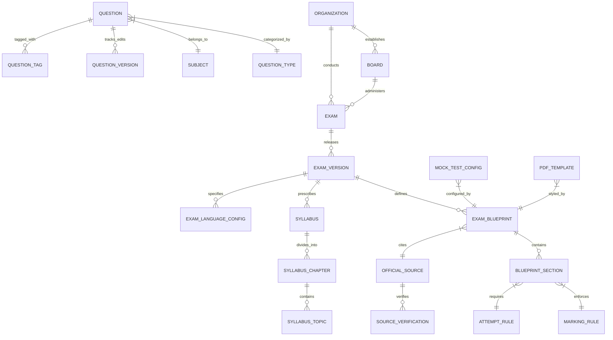

# SARKARIAI HUB — UNIVERSAL EXAM BLUEPRINT & DATA ARCHITECTURE SPECIFICATION
**Phase 2: Master Architectural Specification & Standardized Data Model**
*Document Version: 2.0.0-SPEC | Date: September 2026 | Status: Architectural Design (Non-Destructive)*

---

## 1. EXECUTIVE ARCHITECTURAL SUMMARY
The future of **SarkariAI Hub** is built on a foundational principle: **No two examinations or school boards in India are identical.** 
Previous assumptions—such as treating all competitive exams as 30/50/80 question pickers, or assuming that all non-language subjects across every state board use Hindi+English bilingual papers—are fundamentally invalid for a high-integrity pan-India portal.

The **Universal Exam Blueprint Engine** provides an expressive, strictly typed, relational, and version-controlled data model capable of representing any Indian examination with 100% official fidelity.

---

## 2. THE TWO GOVERNING PRINCIPLES

### 2.1 The Exam-Specific Principle
Every board, entrance, and recruitment examination possesses its own autonomous rules:
* Specific syllabus and chapter weightages.
* Distinct section structures, durations, and marks per question.
* Unique language rules (monolingual regional mediums, bilingual Hindi/English, trilingual state options).
* Strict attempt rules (compulsory questions, attempt $N$ out of $M$, section-wise sectional cutoffs).
* Distinct question formats (single MCQ, multi-correct MCQ, numerical integer input, case studies, assertion-reason, subjective descriptive essays).

**The system never assumes a single universal pattern.**

### 2.2 The Content Trust Principle
To maintain absolute trust for millions of aspirants, information is strictly partitioned into distinct authenticity tiers:
1. **Tier 1: Official Information** — Verbatim data from government gazettes, brochures, and circulars with cryptographic SHA-256 source hashes and publication dates.
2. **Tier 2: AI-Structured Official Information** — Deterministically extracted parameters (dates, eligibility, patterns) directly linked to an official source document.
3. **Tier 3: Official Previous Year Questions (PYQs)** — Authentic questions asked in past examinations with verified year, paper code, and answer keys.
4. **Tier 4: Curated / AI-Generated Practice Material** — Clearly marked as practice items, never misrepresented as official questions.

---

## 3. CORE ENTITY INVENTORY (37 ENTITIES)

### Complete Inventory of Defined Entities:
1. **Organization:** Conducting entity (e.g., UPSC, SSC, CBSE, NTA, RRB, State Police Boards).
2. **Board:** First-class education council entity (National, State, Open School, Madrasa, Sanskrit).
3. **Exam:** High-level examination identity.
4. **Exam Version:** Academic/Recruitment cycle (e.g., SSC CGL 2026, BSEB Matric 2025-26).
5. **Academic Year:** Temporal validity anchor (e.g., '2025-2026').
6. **Class:** Academic standard (Class 10, Class 12, Undergraduate, Postgraduate, Diploma).
7. **Stream:** Academic discipline (Science, Commerce, Arts/Humanities, Vocational).
8. **Stage:** Sequential phase (Prelims, Mains, Tier-1, Tier-2, CBT-1, CBT-2, Interview, Physical Test).
9. **Paper:** Distinct examination sitting (Paper-1, Paper-2, Optional Paper).
10. **Subject:** Core knowledge domain (Mathematics, Physics, History, General Studies).
11. **Subject Group:** Interdisciplinary grouping (e.g., Science Group = Physics + Chemistry + Bio).
12. **Language:** Comprehensive language registry with script, direction, and font metadata.
13. **Exam Language Configuration:** Mapping paper medium, question language, option language, and instruction language.
14. **Syllabus:** Formal curriculum master record.
15. **Syllabus Chapter:** Ordered chapter unit within a subject syllabus.
16. **Syllabus Topic:** Micro-topic with weightage tier (HIGH, MEDIUM, LOW) and official references.
17. **Exam Blueprint:** Complete blueprint defining marks, duration, question count, and attempt rules.
18. **Blueprint Section:** Discrete section with dedicated timer, question count, and marking rules.
19. **Question Type:** Registry of assessment formats (MCQ, numerical, descriptive, matching, etc.).
20. **Marking Rule:** Precise scoring arithmetic (correct, wrong, unattempted, partial).
21. **Attempt Rule:** Candidate choice constraints ($N$ out of $M$, compulsory, optional).
22. **Choice Rule:** Internal choice specifications (e.g., Question 14 OR Question 15).
23. **Official Source:** Traceable government document with URL, publication date, and hash.
24. **Source Document:** Digital archive of official gazettes, brochures, and circular PDFs.
25. **Source Verification Record:** Audit trail certifying human or automated verification.
26. **Question:** Central question entity with immutable ID and classification.
27. **Question Version:** Immutable version record storing question text, options, and explanations across languages.
28. **Question Source:** Traceability link connecting question to official paper or author.
29. **Question Tag:** Metadata tags for searching, difficulty, and algorithmic retrieval.
30. **Mock Test:** Live assessment instance executed by a candidate.
31. **Mock Test Configuration:** Blueprint-driven full test vs. configurable practice test.
32. **Note:** Academic study material, formula sheet, or high-yield revision unit.
33. **Note Section:** Structured section block within a study note.
34. **PDF Template:** Layout, font embedding, and styling rules for printable vector papers.
35. **Content Version:** Version tracker across educational materials.
36. **Change Log:** Automated record of modifications detected across official sources.
37. **Verification Status:** Formal status lifecycle (VERIFIED, NEEDS_REVIEW, CONFLICT, OUTDATED, UNAVAILABLE).

---

## 4. DETAILED SPECIFICATIONS BY SUBSYSTEM

### 4.1 Language Architecture
The system decouples 7 distinct language dimensions:
1. **Website UI Language:** The interface language selected by the user (supporting 24 target languages).
2. **Exam Paper Language:** The medium in which the candidate takes the exam (e.g., Marathi Medium).
3. **Question Language:** The language(s) in which the question statement is rendered (e.g., Bilingual Hindi/English).
4. **Option Language:** The language(s) for options $A, B, C, D$.
5. **Instruction Language:** The language in which section/exam directions are provided.
6. **Language Subject:** Academic subject where language itself is the test (e.g., Sanskrit, Urdu, General English). Language subjects are strictly monolingual.
7. **Paper Medium:** Official delivery configuration (Bilingual, Monolingual, or Multilingual choice).

#### 24 Target UI Languages in Registry:
* English (`en`)
* हिन्दी (`hi` - Hindi)
* Hinglish (`hi-latn`)
* বাংলা (`bn` - Bengali)
* मराठी (`mr` - Marathi)
* తెలుగు (`te` - Telugu)
* தமிழ் (`ta` - Tamil)
* ગુજરાતી (`gu` - Gujarati)
* ಕನ್ನಡ (`kn` - Kannada)
* മലയാളം (`ml` - Malayalam)
* ਪੰਜਾਬੀ (`pa` - Punjabi)
* ଓଡ଼ିଆ (`or` - Odia)
* অসমীয়া (`as` - Assamese)
* اردو (`ur` - Urdu)
* संस्कृतम् (`sa` - Sanskrit)
* मैथिली (`mai` - Maithili)
* भोजपुरी (`bho` - Bhojpuri)
* नेपाली (`ne` - Nepali)
* कोंकणी (`kok` - Konkani)
* सिन्धी (`sd` - Sindhi)
* डोगरी (`doi` - Dogri)
* कश्मीरी (`ks` - Kashmiri)
* संथाली (`sat` - Santali)
* बोडो (`brx` - Bodo)

---

### 4.2 Mock Test Engine Architecture
* **Full Exam Mock:** Question count, sections, marks, negative marking, and duration are **strictly bound to the verified Exam Blueprint**. Users cannot arbitrarily change an official 80-question test into a 30-question test.
* **Practice Sets:** Configurable question counts ($10, 20, 30, 50, 100, 250, 500$, or Custom) drawn dynamically from the verified question bank for the selected subject, chapter, or topic.
* **Timer Enforcement:** Official tests feature true count-down timers with auto-submission upon expiration.
* **Navigation:** Supports Section Tabs, Question Palette status (Answered, Unanswered, Marked for Review, Answered & Marked for Review).

---

### 4.3 High-Fidelity PDF Engine Architecture
* **Full Exam Paper Booklet:** Emulates the official question paper with cover page instructions, bilingual two-column layout, question numbering, and dedicated rough work sections.
* **Printable Vector OMR Sheet:** Scalable SVG-driven bubble grids with candidate roll number blocks and test booklet code grids.
* **Embedded Font Pipeline:** Direct TrueType/OpenType font embedding (`Noto Sans Devanagari`, `Noto Sans Tamil`, etc.) ensuring crisp, uncorrupted Indian script printing on any device.

---

### 4.4 Source Verification & 24×7 Monitoring Architecture
* **Source Registry:** Every official exam circular, brochure, and answer key is logged with its authoritative URL, issuing body, publication date, and SHA-256 hash.
* **Change Detection:** Automated background crawlers poll source endpoints, compute document checksums, and generate `change_logs` entries.
* **Human-in-the-Loop Admin Dashboard:** When a circular changes (e.g. syllabus revision or negative marking update), the system marks the version as `NEEDS_REVIEW` until an admin verifies and approves the migration.

---

## 5. PERSISTENT STORAGE EVALUATION & RECOMMENDATION

| Dimension | Option A: SQLite (Local Server Embedded) | Option B: PostgreSQL (Relational Client/Server) | Option C: Document Store (MongoDB) |
|---|---|---|---|
| **Architectural Fit** | High (Self-contained, zero-ops, file-based) | Highest (Industry standard for multi-table relational integrity) | Low (Lacks strict schema enforcement across 37 relational entities) |
| **Relational Integrity** | Supported (Foreign keys, indexes, check constraints) | Full ACID, Cascading FKs, JSONB, Generated Columns | Weak (Requires manual application-level join logic) |
| **Concurrency** | Single-writer limit; excellent for read-heavy portals | High concurrent reads and writes | High write throughput |
| **Operational Overhead** | Zero (Embedded file in workspace) | Requires separate database server or Docker container | Requires separate daemon or cloud cluster |
| **JSON/Multilingual Querying** | JSON1 extension supported | World-class JSONB indexing (`GIN`, `@>`) | Native JSON |

### Final Recommendation:
1. **Phase 2 & Phase 3 Prototype / Local Deployment:** **SQLite (via `better-sqlite3`)**.
   * *Rationale:* 100% self-contained in the project workspace, zero operational friction, supports all foreign keys, indexes, and JSON queries, and enables instant zero-latency reads for client-side API caching.
2. **Production Cloud Target (Phase 5+):** **PostgreSQL**.
   * *Rationale:* Seamless migration from SQLite DDL to PostgreSQL; provides enterprise clustering, connection pooling, and multi-region replication.

---

## 6. MIGRATION & ADAPTER ROADMAP
* **Phase 2 (Completed):** Complete Architectural Specification, ANSI SQL Schema, JSON Schemas, and Safe Examples. Zero production code altered.
* **Phase 3:** Non-Destructive Database Layer Initialization (SQLite embedded in `backend/db/`). Legacy compatibility adapter bridges database queries to existing `window.EXAMS_DATABASE` and `quiz-data.js` consumers.
* **Phase 4:** Mock Test & PDF Engine Blueprint Upgrade.
* **Phase 5:** Autonomous Ingestion Crawler & Admin Oversight Dashboard.
